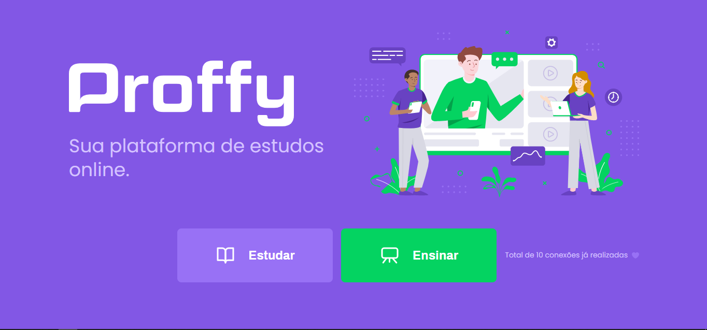
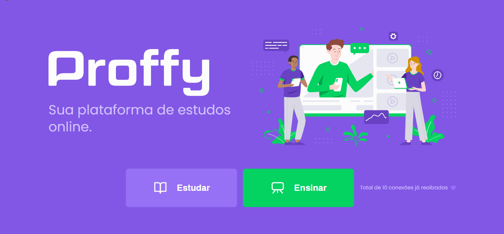



 
*Desenvolvido durante a Next Level Week #2 **Live**: [Proffy](https://proffy-app-gabejabes.netlify.app/)*

>Tem como objetivo a criação de uma plataforma de ensino online.
>É possivel se cadastrar como professor ou como aluno

## Home page

>responsividade

## Realização de cadastro como professor

## Busca por matéria e disponibilidade de horário

------
## 💻 Tecnologias

- Typescript
- Node.js
- ReactJS
- React Native
- Expo
- Express
- axios

## 🚀 Instalando o projeto

 Faça um clone do repositório

    $ git clone https://github.com/araujogabriel77/Proffy.git

Executando
    API
    $ cd server

    instalando as dependências do projeto.
    $ yarn ou npm install

    configurando o banco de dados e criando as tabelas.
    $ yarn knex:migrate # ou npm run knex:migrate

    inicie a API
    $ yarn start # ou npm start

    aplicação web
    $ cd web

    instalando as dependências do projeto.
    $ yarn # ou npm install

    inicie a aplicação web
    $ yarn start # ou npm start

    aplicação mobile
    $ cd mobile

    instalando as dependências do projeto.
    $ yarn # ou npm install

    inicie a aplicação mobile
    $ yarn start # ou npm start

----
## 🐱‍👤 Autor
[Gabriel Araujo](https://github.com/araujogabriel77)

💼 **Linkedin**: [_Gabriel Ferreira_ ](https://www.linkedin.com/in/araujogabriel77/)

📩 **email**: araujogabrielocn@gmail.com

----
## 📃 License

This project is licensed under the MIT License - see the  [LICENSE.md](./LICENSE.md)  file for details